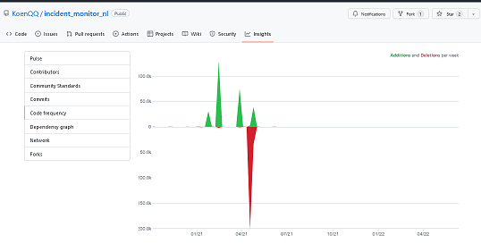

# Building reposnoop

**reposnoop** is a project I had in mind for a while. I wanted to analyze GitHub
repos relevant to a particular topic in a bit more depth without having to
click through them on foot.

> If you need to do it more than three times, automate it.

Now I attend a Python course and have to do my final assignment. So what could be more obvious than to make reposnoop my project?

## Getting started

We want to pull some statistical data from GitHub. GitHub has a pretty good
[API](https://docs.github.com/en/rest), full-featured with tons of instructions, examples and detailed references. This API (like most others) is rate limited. We need to collect the data in a way easy-to-handle, review and save it. We'd like as well to read it back from disk for further analysis. We'd like to see some graphical presentation of data and analysis. And we'd like to handle all of this by a GUI.

Hence, the project divides into:
* building an API client
* defining the data management infrastructure
* develop tools for analysis and charting
* wrap a nice GUI around it for easy interaction

First things first: If we have no data, all of the other steps make no sense.
So we start over prototyping the API client part, to get some real GitHub data. From this we learn early what we will be dealing with further on.

### The GitHub API
The GitHub REST API is pretty well documented, we find it here:

[https://docs.github.com/en/rest](https://docs.github.com/en/rest)

We issue a simple request by curl, and we get:

<details>
  <summary>https://api.github.com (click!)</summary>

    > curl https://api.github.com

    {"current_user_url":"https://api.github.com/user","current_user_authorizations_html_url":"https://github.com/settings/connections/applications{/client_id}","authorizations_url":"https://api.github.com/authorizations","code_search_url":"https://api.github.com/search/code?q={query}{&page,per_page,sort,order}","commit_search_url":"https://api.github.com/search/commits?q={query}{&page,per_page,sort,order}","emails_url":"https://api.github.com/user/emails","emojis_url":"https://api.github.com/emojis","events_url":"https://api.github.com/events","feeds_url":"https://api.github.com/feeds","followers_url":"https://api.github.com/user/followers","following_url":"https://api.github.com/user/following{/target}","gists_url":"https://api.github.com/gists{/gist_id}","hub_url":"https://api.github.com/hub","issue_search_url":"https://api.github.com/search/issues?q={query}{&page,per_page,sort,order}","issues_url":"https://api.github.com/issues","keys_url":"https://api.github.com/user/keys","label_search_url":"https://api.github.com/search/labels?q={query}&repository_id={repository_id}{&page,per_page}","notifications_url":"https://api.github.com/notifications","organization_url":"https://api.github.com/orgs/{org}","organization_repositories_url":"https://api.github.com/orgs/{org}/repos{?type,page,per_page,sort}","organization_teams_url":"https://api.github.com/orgs/{org}/teams","public_gists_url":"https://api.github.com/gists/public","rate_limit_url":"https://api.github.com/rate_limit","repository_url":"https://api.github.com/repos/{owner}/{repo}","repository_search_url":"https://api.github.com/search/repositories?q={query}{&page,per_page,sort,order}","current_user_repositories_url":"https://api.github.com/user/repos{?type,page,per_page,sort}","starred_url":"https://api.github.com/user/starred{/owner}{/repo}","starred_gists_url":"https://api.github.com/gists/starred","topic_search_url":"https://api.github.com/search/topics?q={query}{&page,per_page}","user_url":"https://api.github.com/users/{user}","user_organizations_url":"https://api.github.com/user/orgs","user_repositories_url":"https://api.github.com/users/{user}/repos{?type,page,per_page,sort}","user_search_url":"https://api.github.com/search/users?q={query}{&page,per_page,sort,order}"}

</details><br/>

Nice. That was easy. So much answer at once. And looks like JSON. These URLs seem to be endpoints of the API. Let's try one. We take a quick look at what is currently
[trending Python](https://github.com/trending/python?since=daily)
at GitHub, choose one of the first and check it via users endpoint:


<details>
  <summary>https://api.github.com/users/pittcsc (click!)</summary>

    > curl https://api.github.com/users/pittcsc

    {
      "login": "pittcsc",
      "id": 7276234,
      "node_id": "MDEyOk9yZ2FuaXphdGlvbjcyNzYyMzQ=",
      "avatar_url": "https://avatars.githubusercontent.com/u/7276234?v=4",
      "gravatar_id": "",
      "url": "https://api.github.com/users/pittcsc",
      "html_url": "https://github.com/pittcsc",
      "followers_url": "https://api.github.com/users/pittcsc/followers",
      "following_url": "https://api.github.com/users/pittcsc/following{/other_user}",
      "gists_url": "https://api.github.com/users/pittcsc/gists{/gist_id}",
      "starred_url": "https://api.github.com/users/pittcsc/starred{/owner}{/repo}",
      "subscriptions_url": "https://api.github.com/users/pittcsc/subscriptions",
      "organizations_url": "https://api.github.com/users/pittcsc/orgs",
      "repos_url": "https://api.github.com/users/pittcsc/repos",
      "events_url": "https://api.github.com/users/pittcsc/events{/privacy}",
      "received_events_url": "https://api.github.com/users/pittcsc/received_events",
      "type": "Organization",
      "site_admin": false,
      "name": "Pitt Computer Science Club (CSC)",
      "company": null,
      "blog": "https://pittcsc.org",
      "location": "Pittsburgh, PA",
      "email": null,
      "hireable": null,
      "bio": "Pitt's largest CS student organization. Proudly pushing the boundaries on what it means to be a Pitt student.",
      "twitter_username": null,
      "public_repos": 34,
      "public_gists": 0,
      "followers": 0,
      "following": 0,
      "created_at": "2014-04-12T22:12:43Z",
      "updated_at": "2022-04-06T12:29:53Z"
    }

</details><br/>

It's the Pittsburgh Computer Science Club. Which repositories do they have? We use the info taken from the last response on users endpoint and go like this:

<details>
  <summary>https://api.github.com/users/pittcsc/repos (click!)</summary>

    > curl https://api.github.com/users/pittcsc/repos

    [
      {
        "id": 23943537,
        "node_id": "MDEwOlJlcG9zaXRvcnkyMzk0MzUzNw==",
        "name": "agenda",
        "full_name": "pittcsc/agenda",
        "private": false,
        "owner": {
          "login": "pittcsc",
          "id": 7276234,
          "node_id": "MDEyOk9yZ2FuaXphdGlvbjcyNzYyMzQ=",
          ...
        },
        "html_url": "https://github.com/pittcsc/agenda",
        "description": null,
        "fork": false,
        "url": "https://api.github.com/repos/pittcsc/agenda",
        "forks_url": "https://api.github.com/repos/pittcsc/agenda/forks",
        ...
        "created_at": "2014-09-12T02:15:20Z",
        ...
        "size": 462,
        "stargazers_count": 0,
        "watchers_count": 0,
        "language": "Python",
        "has_issues": false,
        "has_projects": true,
        "has_downloads": true,
        "has_wiki": true,
        "has_pages": false,
        "forks_count": 1,
        "mirror_url": null,
        "archived": true,
        "disabled": false,
        "open_issues_count": 0,
        "license": null,
        "allow_forking": true,
        "is_template": false,
        "topics": [

        ],
        "visibility": "public",
        "forks": 1,
        "open_issues": 0,
        "watchers": 0,
        "default_branch": "master"
      },
      ...
    ]

    (... only an outtake from the whole answer, which spans multiple screens ...)

</details><br/>

This API endpoint sent us back 34 repos sorted in a list of dictionaries (JSON formatted) containing information on the respective owner, repo settings, statistical data and URL to subordinate endpoints delivering even more data. All of this we could have gathered as well by surfing the GitHub web page, but via API it's much faster and much easier to be automagically sorted into manageable data structures.

The API has a [Repository search](https://docs.github.com/en/search-github/searching-on-github/searching-for-repositories#search-by-when-a-repository-was-created-or-last-updated)
endpoint which lets you search repositories for keywords:

    "repository_search_url": "https://api.github.com/search/repositories?q={query}{&page,per_page,sort,order}"

There are quite a lot of repositories on GitHub:


Thus, it makes much sense to use most specific keywords and to further narrow down the search by qualifiers. You can choose from e.g. number of followers, forks or stars, filter by programming language, license or creation/update time. Results are sorted by best match (default) in descending order. The GitHub search API has a custom rate limit at up to 30/10 requests per minute (authenticated/unauthenticated). Responses are given in JSON format.

### The repository search endpoint of the API

--> use your language's preferred HTML-encoder to construct your query strings
- include forks in the search results, you will need to add fork:true
  or fork:only to your query

test repo endpoint with some search queries:

    (a)
    curl "https://api.github.com/search/repositories?q=data+analysis+language%3APython&ref=advsearch"
    # --> 29,613 results
    curl "https://api.github.com/search/repositories?q=brainfuck"
    # --> 7795 results

    (b)
    curl "https://api.github.com/search/repositories?q=osint+twitter+language%3Apython&ref=advsearch"
    # --> 70 results
    curl "https://api.github.com/search/repositories?q=brainfuck+interpreter+license%3Amit+language%3APython+pushed%3A>2021-06-01"
    # --> 22 results.
    curl "https://api.github.com/search/repositories?q=insurance+data+analysis+language%3APython&ref=advsearch"
    # --> 27 results

    (c)
    curl "https://api.github.com/search/repositories?q=multi+agent+genetic+language%3Apython&ref=advsearch"
    # --> 6 results
    curl "https://api.github.com/search/repositories?q=nlp+klingon&ref=advsearch"
    # --> 4 results
    curl "https://api.github.com/search/repositories?q=nlp+animal+language%3Apython&ref=advsearch"
    # --> 3 results

In **group (a),** there are far too many results which still could be reduced easily
by some more specific search terms. **Group (c)** already is very specific - here we could do
a good comparison by hand just by looking into those repos
[insights](https://github.com/KoenQQ/incident_monitor_nl/graphs/code-frequency)
page:



### Filtering search results by activity metrics

We do not care about group a and c. Here, we'd like to find a solution to narrow down group (b) by
measures of recent maintenance trend. In addition to the info you already get by standard
search on the GitHub page, we'd like to know

* if a repo is still under ongoing development, e.g. for feature and security updates
(if the repo is already dead or dying, we'd surely not base our valuable project on it), and
* (if the repo has a vivid community of contributors. --> optional)

This is information we get from the website for a single repo, but not for a list of some
dozen search results at once, which makes it hard to include these metrics in a quantitative comparison.  

[API endpoint](https://docs.github.com/en/rest/metrics/statistics#get-the-last-year-of-commit-activity)
to get the last 52 weeks of commit activity:


<details>
  <summary>repository commit activity (click!)</summary>

    curl "https://api.github.com/repos/rasbt/mlxtend/stats/commit_activity"

    [
      {
        "total": 2,
        "week": 1623542400,
        "days": [
          2,
          0,
          0,
          0,
          0,
          0,
          0
        ]
      },

     ...

      {
        "total": 36,
        "week": 1651363200,
        "days": [
          6,
          2,
          7,
          9,
          9,
          3,
          0
        ]
      },
      {
        "total": 3,
        "week": 1651968000,
        "days": [
          ...
        ]
      }
    ]

</details><br/>

[API endpoint](https://docs.github.com/en/rest/metrics/statistics#get-all-contributor-commit-activity)
to get a project's contributors and their commits by week:

<details>
  <summary>contributor commit activity (click!)</summary>

      curl "https://api.github.com/repos/rasbt/mlxtend/stats/contributors"

      [
       {
          "total": 18,
          "weeks": [
            {
              "w": 1420934400,
              "a": 0,
              "d": 0,
              "c": 0
            },
            ...
            {
              "w": 1489881600,
              "a": 12,
              "d": 8,
              "c": 1
            },
            ...
            {
              "w": 1654387200,
              "a": 0,
              "d": 0,
              "c": 0
            }
          ],
          "author": {
            "login": "jrbourbeau",
            "id": 11656932,
            ...
            "type": "User",
            "site_admin": false
          }
        },
        ...
      ]

</details><br/>

This looks like the information we're after. Until now we just tested the API via curl.
Now it's time to make a first Python prototype, stuff all the data in some handy
structure and look look how we can condense it into a form which
is accessible to human perception.

## A first prototype for gathering data

<details>
  <summary>send repository search request</summary>

    import requests

    API_SEARCH = "https://api.github.com/search/repositories?"
    API_COMMITS = "https://api.github.com/repos/OWNER/REPO/stats/commit_activity"
    API_CONTRIBUTORS = "https://api.github.com/repos/OWNER/REPO/stats/contributors"


    def github_client_main():
        """Test / present modules class(es)."""
        # search query has to be crafted by user input later
        search_kw = ["intelligence", "twitter"]
        search_url = "&".join([API_SEARCH, f"q={'+'.join(search_kw)}+language%3Apython",
                               "ref=advsearch", "per_page=100"])
        print("searching for " + search_url)

        # sending out request. URL should still be built better
        search_response =  requests.get(search_url)
        print("\nHeaders:", search_response.headers['content-type'])
        print("Encoding:", search_response.encoding)
        print("Status:", search_response.status_code)

        # meanwhile we use the requests json parser
        result_json = search_response.json()
        print(f"\nResponse:\n    incomplete results: {result_json['incomplete_results']}")
        print(f"    number of items: {len(result_json['items'])}")
        print(f"    items total_count, should be: {result_json['total_count']}")

        for item in result_json['items']:
            print(f"\n{'name: ':<20}{str(item['name']):<35}")
            print(f"{'updated_at: ':<20}{str(item['updated_at']):<35}")
            print(f"{'stargazers_count: ':<20}{str(item['stargazers_count']):<35}")

        return None


    if __name__ == "__main__":
        github_client_main()

</details><br/>

da


<br/>
<br/>
<br/>

### Work in progress

By now this project is under heavy construction. Everything you see here might be non-functional
or contain code or ressources that are not intended to stay here.

<br/>
<br/>
<br/>
<br/>

***

### Here comes only copy-paste boilerplate text.

<br/>

> A place to copy-paste your README.md from

One of the most crucial things in your open source project is the `README.md`
file. This repository has a ready-to-copy-paste template you can use for all
your projects.

## Getting started

Copy the `README-default.md` file for yourself and start editing! At the root of
your project, run:

```shell
curl https://raw.githubusercontent.com/jehna/readme-best-practices/master/README-default.md > README.md
```

The code above fetches the `README-default.md` file from this repository.
Here you should say what actually happens when you execute the code above.

### Initial Configuration

Some projects require initial configuration. How to start the prog:

```shell
atom README.md
```

And again you'd need to tell what the previous code actually does.

## Features

What's all the bells and whistles this project can perform?
* What's the main functionality
* You can also do another thing
* If you get really randy, you can even do this

## Configuration

Here you should write what are all of the configurations a user can enter when
using the project.

## Ressources

Which ressources are used, e.g. libs, APIs ...

#### Argument 1
Type: `String`  
Default: `'default value'`

State what an argument does and how you can use it. If needed, you can provide
an example below.

Example:
```bash
awesome-project "Some other value"  # Prints "You're nailing this readme!"
```

#### Argument 2
Type: `Number|Boolean`  
Default: 100


```shell
git add README.md
git commit -m "Added: README"
git push
```


E.g. if you have a perfect `README.md` for a Grunt project, just name it as
`README-grunt.md`.

## Related projects

Here's a list of other related projects where you can find inspiration for
creating the best possible README for your own project:

- [Billie Thompson's README template](https://gist.github.com/PurpleBooth/109311bb0361f32d87a2)
- [A list of awesome READMEs](https://github.com/matiassingers/awesome-readme)
- [Akash Nimare's kickass README guide](https://gist.github.com/akashnimare/7b065c12d9750578de8e705fb4771d2f)
- [Dan Bader's README template](https://github.com/dbader/readme-template)

## System requirements

here some screenshots ...

## Screenshots

here some screenshots ...

## Licensing

This project is licensed under MIT license.

View [LICENSE](LICENSE).

[issues]:https://github.com/jehna/readme-best-practices/issues/new

> How to paste blockquotes.

Tables work, too.
Colons can be used to align columns.

| Tables        | Are           | Cool  |
| ------------- |:-------------:| -----:|
| col 3 is      | right-aligned | $1600 |
| col 2 is      | centered      |   $12 |
| zebra stripes | are neat      |    $1 |

There must be at least 3 dashes separating each header cell.
The outer pipes (|) are optional, and you don't need to make the
raw Markdown line up prettily. You can also use inline Markdown.

    Markdown | Less | Pretty
    --- | --- | ---
    *Still* | `renders` | **nicely**
    1 | 2 | 3


some kind of `strikethrough.txt` for file names

run stuff in shell (command line):

```shell
curl https://raw.githubusercontent.com/jehna/readme-best-practices/master/README-default.md > README.md
```

## Starting over: First week.
Here are
some of the tasks:

<details>
    <summary>Example #1 (click!)</summary>

        source code
        source code
        source code

</details>

Easily make a list:
* just put stars at
* the beginning of the line
* and it will magically format itself

<br/>

Interpreter for [Brainfuck](https://en.wikipedia.org/wiki/Brainfuck) programs.

https://github.com/matiassingers/awesome-readme
